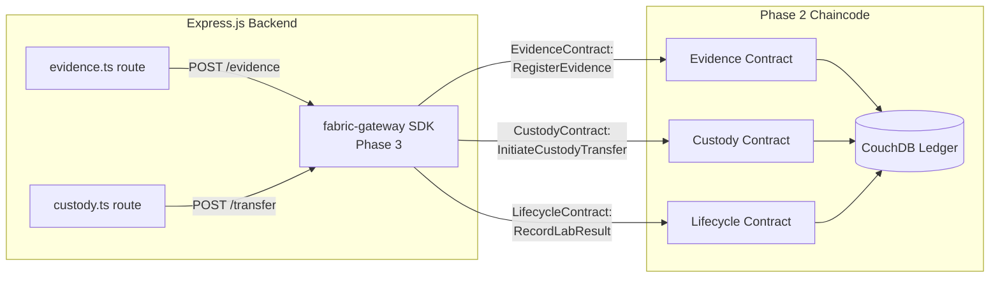

# Phase 2: Go Smart Contracts (Chaincode) Development

## 📌 Overview

**Phase 2** builds the **Go smart contracts** (chaincode) that run inside the Hyperledger Fabric peer nodes provisioned in Phase 1. The chaincode is the on-chain business logic layer — every evidence registration, custody transfer, and lab result is permanently recorded to the immutable ledger through these contracts.

**Key distinction from Phase 1**: Phase 1 built the *network infrastructure*. Phase 2 defines *what runs on that network* — the smart contract rules that govern evidence integrity.

---

## 🏗️ What Phase 2 Accomplished

1. **Go module** with `fabric-contract-api-go v1.2.2` dependency
2. **Data models** mirroring the Prisma SQLite schema for consistent dual-storage
3. **Role-Based Access Control** enforced at chaincode level via X.509 cert attributes
4. **Evidence Contract** — registration, status management, CouchDB rich queries, hash verification
5. **Custody Contract** — 3-step transfer workflow (initiate → approve/reject), full audit trail
6. **Lifecycle Contract** — genesis initialization, lab results, aggregate stats
7. **Compiled** (`go build ./...` → zero errors) and **deployed** to `evidence-channel` ✅

---

## 📁 Files Created in `chaincode/evidence/`

```
chaincode/evidence/
├── go.mod                        # Go module: github.com/evidence-chain/chaincode
├── go.sum                        # Dependency checksums (auto-generated by go mod tidy)
├── main.go                       # Entry point — registers all 3 contracts, starts shim
├── models/
│   └── types.go                  # EvidenceRecord, CustodyRecord, LabResultRecord, Stats
└── contracts/
    ├── access.go                 # RequireRole(), RequireOrg() — X.509 RBAC enforcement
    ├── evidence.go               # RegisterEvidence, UpdateStatus, queries, VerifyHash
    ├── custody.go                # InitiateTransfer, ApproveTransfer, RejectTransfer, History
    └── lifecycle.go              # InitLedger, RecordLabResult, GetAllEvidence, Stats
```

---

## 🔑 Smart Contract Functions Reference

### EvidenceContract
| Function | Roles Allowed | Description |
|:---|:---|:---|
| `RegisterEvidence` | officer, admin | Creates immutable evidence record with SHA-256 hash |
| `UpdateEvidenceStatus` | role-dependent | Updates status per role-to-status permission matrix |
| `GetEvidence` | all | Retrieves a single evidence record by ID |
| `GetEvidenceByCase` | all | CouchDB rich query: all evidence for a case |
| `GetEvidenceByOfficer` | officer (own), admin | CouchDB rich query: evidence by collecting officer |
| `GetEvidenceByStatus` | custodian, analyst, prosecutor, admin | CouchDB rich query: filter by status |
| `VerifyEvidenceHash` | all | Compares provided SHA-256 vs stored on-chain hash |

### CustodyContract
| Function | Roles Allowed | Description |
|:---|:---|:---|
| `InitiateCustodyTransfer` | officer, custodian, admin | Creates pending custody event on ledger |
| `ApproveCustodyTransfer` | custodian, admin | Finalizes transfer — atomically updates both CustodyRecord + EvidenceRecord custodian |
| `RejectCustodyTransfer` | custodian, admin | Marks custody event rejected, no custodian change |
| `GetCustodyHistory` | all | Full custody audit trail via CouchDB rich query |
| `GetLedgerCustodyHistory` | prosecutor, admin | Fabric-native block-level key history (prosecution-grade) |

### LifecycleContract
| Function | Roles Allowed | Description |
|:---|:---|:---|
| `InitLedger` | admin | Writes genesis metadata record on first deploy |
| `GetLedgerMetadata` | admin | Returns genesis metadata (deployment info, version) |
| `RecordLabResult` | analyst (ForensicLabMSP) | Creates immutable forensic lab result on ledger |
| `GetLabResults` | analyst, prosecutor, admin | All lab results for an evidence item |
| `GetAllEvidence` | admin | All evidence records (admin audit) |
| `GetEvidenceStats` | custodian, analyst, prosecutor, admin | Count by status for dashboard |

---

## 🔐 Role-to-Status Permission Matrix

The `UpdateEvidenceStatus` function enforces which roles can transition evidence to which statuses:

| Role | Allowed Statuses |
|:---|:---|
| `officer` | `collected`, `under_review` |
| `custodian` | `in_lab`, `in_court`, `archived` |
| `analyst` | `analyzed` |
| `prosecutor` | `in_court` |
| `admin` | Any status (override) |

---

## 🚀 How to Deploy Phase 2

### Prerequisites
- Phase 1 network must be running (`docker ps` shows all 8 containers)

### Deploy the chaincode:
```bash
# From project root — copies deploy script into CLI container and executes it
docker cp C:/path/to/scratch/deploy-cc.sh fabric_cli:/tmp/deploy-cc.sh
docker exec fabric_cli chmod +x /tmp/deploy-cc.sh
docker exec fabric_cli bash /tmp/deploy-cc.sh
```

**Or use the automated script (from `fabric-network/`):**
```bash
cd fabric-network
MSYS_NO_PATHCONV=1 ./scripts/deploy-chaincode.sh
```

> [!NOTE]
> On Windows, the `deploy-chaincode.sh` heredoc injection may silently fail. Use the `docker cp` method above as the reliable alternative.

### Verify deployment:
```powershell
docker exec fabric_cli bash -c "
  CORE_PEER_LOCALMSPID=PoliceDeptMSP \
  CORE_PEER_TLS_ROOTCERT_FILE=/etc/hyperledger/fabric/organizations/peerOrganizations/police.evidence.com/peers/peer0.police.evidence.com/tls/ca.crt \
  CORE_PEER_MSPCONFIGPATH=/etc/hyperledger/fabric/organizations/peerOrganizations/police.evidence.com/users/Admin@police.evidence.com/msp \
  CORE_PEER_ADDRESS=peer0.police.evidence.com:7051 \
  peer lifecycle chaincode querycommitted -C evidence-channel -n evidence
"
```

**Expected output:**
```
Committed chaincode definition for chaincode 'evidence' on channel 'evidence-channel':
Version: 1.0, Sequence: 1, Endorsement Plugin: escc, Validation Plugin: vscc,
Approvals: [ForensicLabMSP: true, PoliceDeptMSP: true]
```

---

## 📊 Deployment Status (LIVE ✅)

| Item | Status |
|:---|:---|
| Go compilation (`go build ./...`) | ✅ Zero errors |
| `go mod tidy` (dependencies) | ✅ All resolved |
| Package on police peer | ✅ |
| Package on forensic peer | ✅ |
| PoliceDeptMSP approval | ✅ true |
| ForensicLabMSP approval | ✅ true |
| Committed to `evidence-channel` | ✅ Version 1.0, Sequence 1 |
| Transaction ID | `78232dd47d01a4d0a66b81795b25aaadf40cb70edb07c0f55c7a80c892fcb986` |

---

## 🔗 How Phase 2 Links to the Web App



**What happens on every evidence registration:**
1. Express route saves to SQLite (fast UI read path)
2. Express calls `EvidenceContract.RegisterEvidence` via Fabric Gateway SDK (Phase 3)
3. Both peers execute the chaincode, endorse the transaction
4. Orderer creates a new block, commits to CouchDB
5. Express receives the `blockchainTxId` → stores in SQLite → returns to frontend
6. Frontend displays a **"Blockchain Verified"** badge with the transaction ID

---

## 🛠️ Known Issues & Gotchas

### Windows Backslash WARN Messages
```
WARN [msp] loadCertificateAt → Failed loading ClientOU certificate at [cacerts\ca...]
```
**Non-fatal** — caused by Windows backslashes in crypto paths mounted into Linux containers. The MSP still loads via the peer's config. Transactions commit with `VALID` status regardless.

### deploy-chaincode.sh Heredoc on Windows
When run via PowerShell, the `cat > /script.sh << HEREDOC` injection silently creates an empty file. **Fix**: Use `docker cp` to copy the script directly into the container before `docker exec`.

---

## 📋 Next Phases

- **Phase 3**: Install `@hyperledger/fabric-gateway` Node.js SDK. Write `src/lib/fabric.ts` to connect to the Fabric network using enrolled X.509 certs. Wire `evidence.ts` and `custody.ts` Express routes to submit blockchain transactions.
- **Phase 4**: Frontend UI — blockchain transaction ID display, `VerifyEvidenceHash` badge, `GetCustodyHistory` ledger view, audit report exporter.
